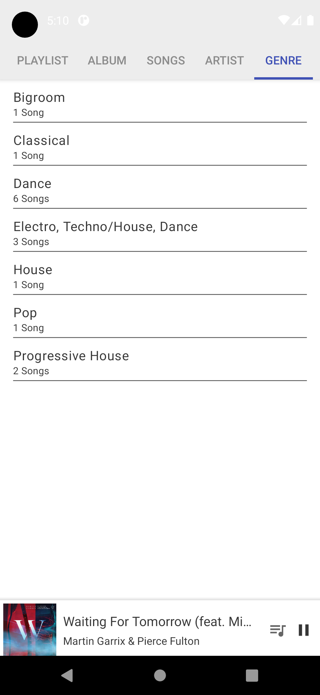
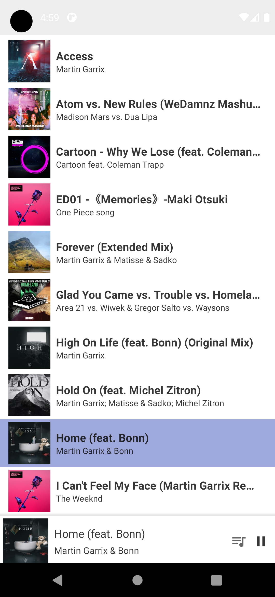

# AKXPlayer
AKXPlayer is simple music media player app to play tracks and view them in categories as albums, songs, artist and genre. 
App can create your own new playlists and add songs to them.

## Tools Used
* Foreground Service
* View Binding
* Data Binding
* MVVM
* Room Database (cache)
* Notification
* Broadcast Receiver
* MediaPlayer
* MediaSession

  
   
  
  
   
  
  
   
  
  
   
  

#### References
* https://youtu.be/XQwe30cZffg
* https://youtu.be/iIKxyDRjecU
